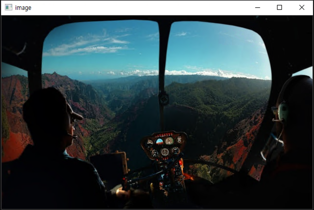
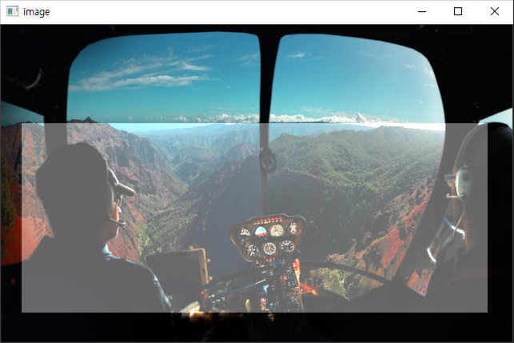

드레그 함수에서 클릭을 조건으로 걸고 실행하였고 Beta  값을 올려 밝기를 올려주었다.

``` c++
//핵심 코드이다.
		if (event == EVENT_LBUTTONDOWN) {   // 마우스의 왼쪽 버튼을 누르면
        cropping = true; //마우스를 누른 상태인지 표시하기 위함
        mx1 = x;        // 사각형의 좌측 상단 좌표 저장
        my1 = y;
    }
    else if (event == EVENT_MOUSEMOVE) {    //마우스가 움직이면
        if (cropping == true) {		//마우스가 눌린 상태로 움직이는지 그냥 움직이는지 판단.
            mx2 = x;    // 사각형의 우측 하단 좌표 저장
            my2 = y;
            for (int y = my1; y < my2; y++) {
                for (int x = mx1; x < mx2; x++) {
                    for (int c = 0; c < 3; c++) {
                        B.at<Vec3b>(y, x)[c] =
                            saturate_cast<uchar>(image.at<Vec3b>(y, x)[c] + beta);
                        // 화면의 밝기가 밝아지는 부분
                    }
                }
            }
            imshow("image", B);
        }
    }
    else if (event == EVENT_LBUTTONUP) {    // 마우스의 왼쪽 버튼에서 손을 떼면
        cropping = false;		//마우스를 누르지 않은 상태를 표시하기 위함
    }
```


